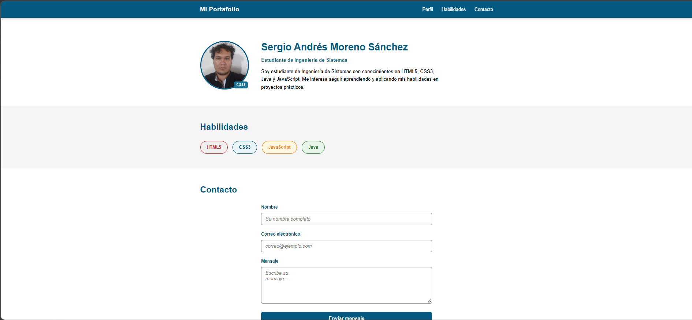

# Perfil Personal - PostContenido U3

## Autor
**Sergio Andrés Moreno Sánchez**  
Estudiante de Ingeniería de Sistemas - Universidad de Santander (UDES)

---

## Descripción
Este proyecto corresponde al laboratorio de la Unidad 3 de Programación Web (CSS3 Básico).  
Se construye una página web de perfil personal aplicando:

- Selectores CSS avanzados  
- Box Model con `box-sizing: border-box`  
- Posicionamiento (`fixed`, `relative`, `absolute`)  
- Estilos accesibles para formularios  

El resultado es una página con tres secciones principales: **Perfil**, **Habilidades** y **Contacto**.

---

## Instrucciones de ejecución
1. Clonar o descargar este repositorio:
   git clone https://github.com/SergioMoreno09dev/Moreno-post1-u3.git

